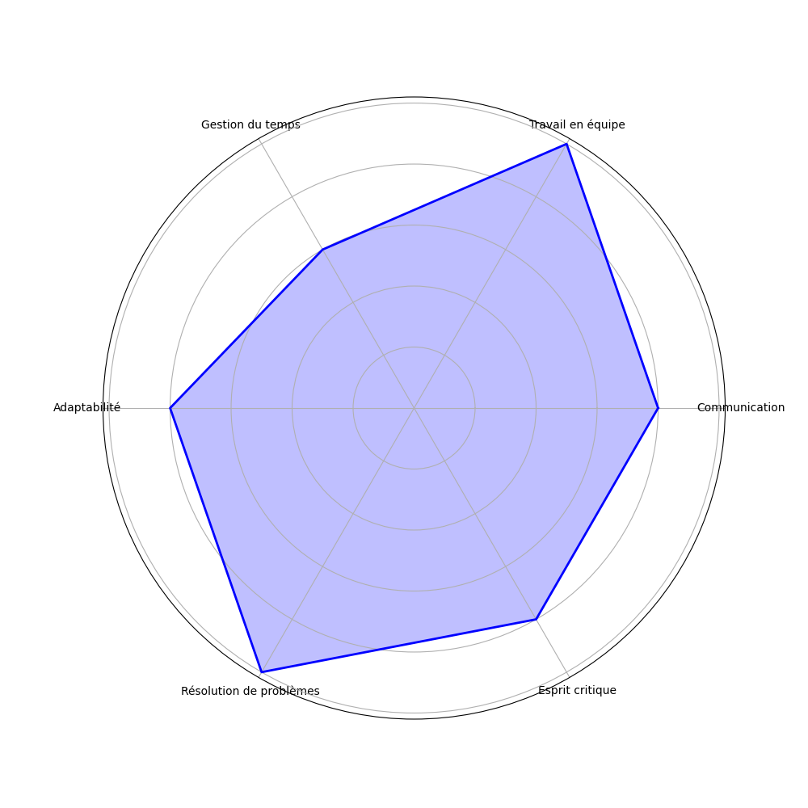

# Bienvenue sur mon profil GitHub ! 👋

## 😄 A propos de moi

Je suis Sébastien COLASSE, un développeur passionné de développement web. J'aime pouvoir m'occuper de l'image d'une entreprise, par le biais de la création de leur site.

- 📖 Actuellement en troisième année de Bachelor en informatique à l'IUT du Limousin.
- 🎓 Je découvre actuellement le typescript
- 🏢 Je suis ouvert à toute proposition de projet ou de collaboration.

## ✏️ Mes Projets

Retrouvez ici la liste des projets que j'ai pu réaliser :

- **Mini-Jeux** - Création d'une application de jeu comme le morpion, le jeu des allumettes et un puissance 4. (2022-2023) (Terminé):  
  

- **Le Verger** - Développement d'un jeu de plateau interactif, un Java/Java Fx (2023) (Terminé):  
   

- **BDD** - Réalisation d'une application web de remontée de données (2023-2024) (Terminé):  
       

- **Fils Rouge** - Réalisation d'une filmothèque en ligne via Bootstrap (2023-2024) (Terminé):  
  

- **Météo** - Création d'une application Android/iOS de météo (2023-2024) (Terminé):  
   

- **Projet Tutore** - Développement d'une application de statistique (2024 - ) :  
      

- **Mingoton** - Réalisation d'une application de cuisine (2024) (Terminé):  
       

- **XYZ** - Filmothèque utilisateur (2024) (Terminé):  
  

## 🛠️ Mes compétences

### Langages Front-End

       

### Langages Back-End

      

### Langages Serveur

  

### Bases de Données

    

### Tests

  

### Mobile

 

### Scripting

### Outils de Développement

 

### Systèmes d'Exploitation

  

## 💁 Soft Skills

### Communication

Je suis capable de communiquer efficacement avec les membres de l'équipe et les clients, en utilisant des compétences verbales et écrites pour transmettre des idées et des informations clairement.

### Travail d'équipe

Je travaille bien en équipe, en collaborant avec les autres pour atteindre des objectifs communs et en apportant mon soutien et mon expertise lorsque cela est nécessaire.

### Gestion du temps

Je gère efficacement mon temps, en priorisant les tâches et en respectant les délais pour assurer la livraison des projets dans les temps impartis.

### Résolution de problèmes

Je suis capable d'identifier et de résoudre les problèmes de manière proactive, en utilisant des compétences analytiques et créatives pour trouver des solutions efficaces.

### Adaptabilité

Je m'adapte facilement aux nouvelles situations et aux changements, en restant flexible et ouvert aux nouvelles idées et aux nouvelles méthodes de travail.

### Leadership

Je possède des compétences en leadership, en guidant et en motivant les membres de l'équipe pour atteindre les objectifs du projet et en assurant un environnement de travail positif.

  

## 🎨 Hobby

- 🎬 Cinéma
- ✈️ Voyage
- 🚗 Voiture

## 📬 Me Contacter

- Email: [sebastien.colasse@etu.unilim.fr](mailto:sebastien.colasse@etu.unilim.fr)
- LinkedIn: [Sébastien COLASSE](https://www.linkedin.com/in/s%C3%A9bastien-colasse-349942276/)
